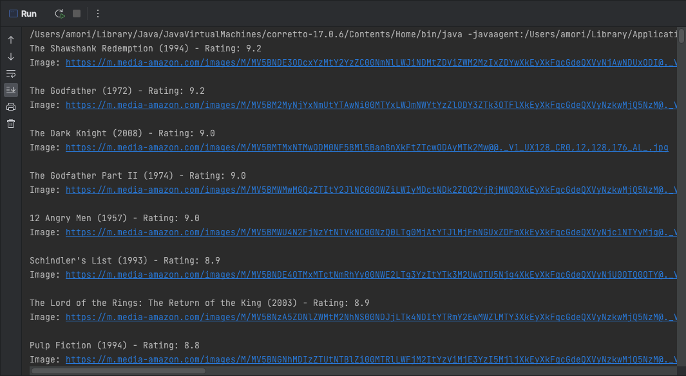

# 7 Days Of Code: Java

**[7DaysOfCode.io](https://7daysofcode.io)** is a webpage maintained by [Alura](https://www.alura.com.br) — a Brazilian
Technology School — with a set of code challenges divided by technology (languages, frameworks, tools, etc.) so the
students can put in practice their knowledge solving 7 challenges, one per day, in the technology they're learning.

**This repository is for the Java challenges.** Learn more and subscribe at https://7daysofcode.io/matricula/java

## Day 1

On the first day, you will make your Java code consume the IMDB API, fetch the top 250 movies from their list and print
the corresponding JSON in the console.

### References

* [IMDB API](https://imdb-api.com/api)
* [OpenJDK.org: Introduction to the Java HTTP Client](https://openjdk.org/groups/net/httpclient/intro.html)
* [Java System.getProperty vs System.getenv](https://www.baeldung.com/java-system-get-property-vs-system-getenv)

## Day 2

On that day, you will parse the JSON response you get from IMDB to extract its information and attributes (such as
title, poster, rating, etc).

> As and extra, I decided to cache the API response in order to save resources and avoid being blocked by IMDB server
> due to too many requests. Certainly there are better ways to do that... but I developed my own solution, and I'm proud
> of it :-)

### Screenshot

### References

* [Java Program to Write into a File](https://www.geeksforgeeks.org/java-program-to-write-into-a-file/)
* [Java API: Class File ::createTempFile](https://docs.oracle.com/javase/7/docs/api/java/io/File.html#createTempFile)
