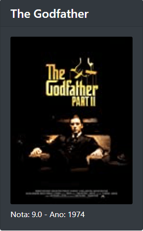
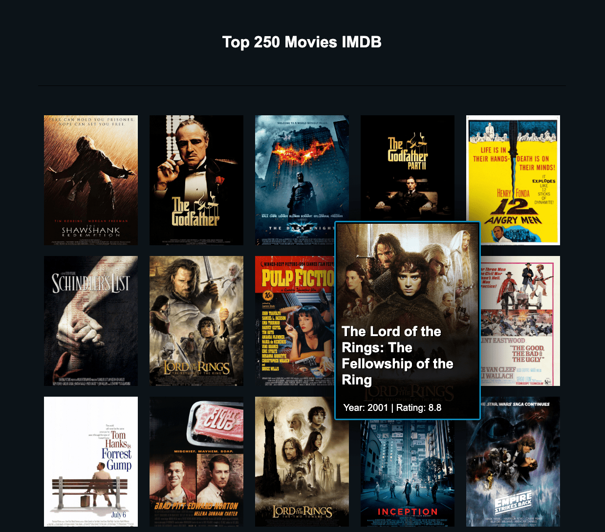

# 7 Days Of Code: Java

**[7DaysOfCode.io](https://7daysofcode.io)** is a webpage maintained by [Alura](https://www.alura.com.br) — a Brazilian
Technology School — with a set of code challenges divided by technology (languages, frameworks, tools, etc.) so the
students can put in practice their knowledge solving 7 challenges, one per day, in the technology they're learning.

**This repository is for the Java challenges.** Learn more and subscribe at https://7daysofcode.io/matricula/java

## Day 1: Consuming IMDB API

On the first day, you will make your Java code consume the IMDB API, fetch the top 250 movies from their list and print
the corresponding JSON in the console.

### References

* [IMDB API](https://imdb-api.com/api)
* [OpenJDK.org: Introduction to the Java HTTP Client](https://openjdk.org/groups/net/httpclient/intro.html)
* [Java System.getProperty vs System.getenv](https://www.baeldung.com/java-system-get-property-vs-system-getenv)

## Day 2: Parsing the JSON response

On that day, you will parse the JSON response you get from IMDB to extract its information and attributes (such as
title, poster, rating, etc).

> As and extra, I decided to cache the API response in order to save resources and avoid being blocked by IMDB server
> due to too many requests. Certainly there are better ways to do that... but I developed my own solution, and I'm proud
> of it :-)

### Screenshot

### References

* [Java Program to Write into a File](https://www.geeksforgeeks.org/java-program-to-write-into-a-file/)
* [Java API: Class File ::createTempFile](https://docs.oracle.com/javase/7/docs/api/java/io/File.html#createTempFile)

## Day 3: Modeling `Movie`

In today's challenge, the idea will be to model, or at least start modeling your code better. A `Movie` should have the
following attributes: `title`, `urlImage`, `rating` and `year`.

Also, instead of having several lists (one for each movie attribute), it's much better to organize this into a
single `List<Movie>`, where each movie encapsulates its own data.

### References

* [Java Language Updates: Records Classes](https://docs.oracle.com/en/java/javase/15/language/records.html)
* [Java API: Interface Map<K,V>](https://docs.oracle.com/javase/8/docs/api/java/util/Map.html)

## Day 4: Generating an HTML page

In the day four you're going to generate an HTML page from the list of objects you already have in your Java code. The
HTML page will have the information about the movie, including the poster, something like:

### Screenshot

_— See this page at https://afonsodemori.github.io/sevendays-java/day-4-movies.html_

### References

* [Java API: Class PrintWriter](https://docs.oracle.com/javase/7/docs/api/java/io/PrintWriter.html)

## Day 5: Encapsulating our code

Today's challenges are:

* Encapsulating the API call inside a new class. You can call this class `ImdbApiClient`.
* Also, to improve encapsulation and separate all responsibilities into their proper classes, create a new class to
  parse the JSON.

### References

* [Alura: What is encapsulation?](https://www.alura.com.br/artigos/o-que-e-encapsulamento) _(in portuguese)_
